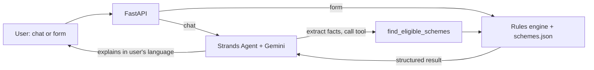

# 🇮🇳 Sarkari Saathi

> Tell it about yourself in Hindi, English or Hinglish. It tells you which government schemes you're eligible for, what documents you need, and where to apply.

Built for the **Bharat Builds x AWS Tour: First Commit** hackathon, **Build It track** (open-source tools on your own machine: no AWS account, no card, no bill). Theme: *build something that solves a real problem*.

## The problem

India runs hundreds of central and state welfare schemes, yet many eligible people never claim them. Information is scattered across portals, written in dense official language, and eligibility rules differ per scheme. A farmer, a student and a small-business owner each need a *different* answer, and most people don't know what to search for.

## What it does

- **Chat (multilingual):** describe yourself in plain language; the agent extracts your details, checks them against the rules, and replies in *your* language.
- **Quick form:** the same result with no AI at all, instant and works offline.
- **Transparent results:** each scheme is **Eligible** or **Possibly eligible (needs info)**, with the reason and the exact fields still missing.
- **Actionable:** benefit summary, documents checklist and the official portal link.
- **Private:** no accounts, no database; nothing is stored.

## How it works



**Key idea: the LLM never decides eligibility.** Rules live in [`schemes.json`](src/saathi/schemes.json) and are evaluated by a small, tested Python engine ([`engine.py`](src/saathi/engine.py)). The agent, built with the open-source [Strands Agents SDK](https://github.com/strands-agents/sdk-python), only (1) extracts facts from free text, (2) calls the engine as a tool, and (3) explains the result. Unknown facts are never guessed; they become follow-up questions. See [DECISIONS.md](DECISIONS.md) for the reasoning.

## Quick start

Requires Python 3.10+.

**Windows (Command Prompt)**
```bat
git clone https://github.com/deepanshu-meena/sarkari-saathi.git
cd sarkari-saathi
python -m venv .venv
.venv\Scripts\activate
pip install -e ".[dev]"
pytest -q
uvicorn saathi.api:app --reload
```

**Mac / Linux**
```bash
git clone https://github.com/deepanshu-meena/sarkari-saathi.git
cd sarkari-saathi
python -m venv .venv && source .venv/bin/activate
pip install -e ".[dev]"
pytest -q
uvicorn saathi.api:app --reload
```

Open http://127.0.0.1:8000. The **Quick form** works immediately with no key.

### Enable the Chat tab (free Gemini key)

1. Get a free key at [aistudio.google.com](https://aistudio.google.com) (**Get API key**).
2. Copy the example config and add your key:
   - Windows: `copy .env.example .env`
   - Mac/Linux: `cp .env.example .env`
3. Edit `.env` and set `GEMINI_API_KEY=your_key`. The file is loaded automatically and is git-ignored.
4. Restart `uvicorn` and try the Chat tab, e.g. *"Main 34 saal ki kisan hoon, meri zameen hai aur ration card BPL hai."*

Default model: `gemini/gemini-3.6-flash` (tested working with tool calling).

### Other free models

| Provider | Cost | `.env` settings |
|---|---|---|
| **Gemini** (default) | Free tier | `MODEL_PROVIDER=gemini`, `GEMINI_API_KEY` |
| **Ollama** (local, offline) | Free | Install [Ollama](https://ollama.com), `ollama pull qwen3:8b`, set `MODEL_PROVIDER=ollama` |
| **Groq** | Free tier | `MODEL_PROVIDER=groq`, `GROQ_API_KEY` |
| **OpenRouter free models** | Free tier | `MODEL_PROVIDER=litellm`, `MODEL_ID=openrouter/<model>:free`, `OPENROUTER_API_KEY` |

> **Model names get retired.** Google already retired `gemini-2.5-flash` for new keys. If Chat fails with `NotFoundError`, set `MODEL_ID` to a current model (list yours at `https://generativelanguage.googleapis.com/v1beta/models?key=YOUR_KEY`). No code change is needed, and the model must support tool calling. If Chat fails, the real error is printed in the terminal running `uvicorn`.

## API

| Method | Path | Description |
|---|---|---|
| GET | `/api/health` | Liveness |
| GET | `/api/schemes` | All schemes and rules |
| POST | `/api/eligibility` | Profile JSON in, grouped eligibility result out (no LLM) |
| POST | `/api/chat` | `{session_id, message}` in, `{reply}` out (uses the agent; `503` if no model) |

```bash
curl -s localhost:8000/api/eligibility -H "content-type: application/json" \
  -d '{"age": 34, "gender": "female", "occupation": "farmer", "owns_land": true, "is_bpl": true}'
```
(Windows Command Prompt: put it on one line and write the JSON as `"{\"age\": 72}"`.)

You can also run the rules engine alone: `python -m saathi.cli --demo`.

## Project layout

```
sarkari-saathi/
├── src/saathi/
│   ├── engine.py          # deterministic rules engine (the source of truth)
│   ├── schemes.json       # scheme data + rules (add a scheme = add JSON)
│   ├── agent.py           # Strands agent, tools, model factory
│   ├── api.py             # FastAPI app (+ serves the UI)
│   ├── cli.py             # terminal chat / --demo
│   ├── lambda_handler.py  # optional AWS Lambda entrypoint (not required)
│   └── static/index.html  # mobile-friendly single-page UI
├── tests/                 # engine, API, agent wiring, Lambda handler
├── template.yaml          # optional AWS SAM template (not required)
├── DECISIONS.md           # design decisions and trade-offs
├── .env.example
└── .github/workflows/ci.yml
```

## Adding a scheme

Append an object to `schemes.json`. Conditions support `eq, in, gte, lte, between, is_true, is_false`, grouped under `all` (every one must hold) and `any` (at least one). Add a test in `tests/test_engine.py`.

## Limitations (honest)

- **Data is a simplified snapshot** of 13 central schemes, last reviewed 2026-09. Amounts and criteria change and many schemes have state-level variants. The app tells users to confirm on the official portal. **This is not legal or official advice.**
- No state-specific schemes yet.
- Chat quality depends on the model's tool-calling ability; the form and API are always deterministic.
- `template.yaml` and `lambda_handler.py` are an optional extra for the deterministic API. The handler is unit-tested, but the template has not been deployed, and this project does not depend on AWS.

## Roadmap

State-wise schemes, voice input, WhatsApp/SMS channel, auto-refreshing scheme data from official sources, application-status tracking, and more regional languages.

## License

MIT
